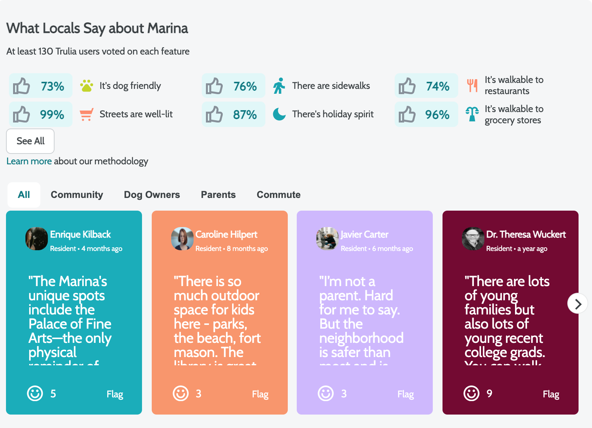

# Local Review
---

>This is local-review component of Trulia.com real estate application. It displays the reviews of local neighbors for the property. Also you can see the current ratings of features and expand the view to see more.

## Related Projects

  - https://github.com/Archon-Design/AffordabilityCalculator
  - https://github.com/Archon-Design/similar-homes-service
  - https://github.com/Archon-Design/PhotoGallery

## Table of Contents

1. [Usage](#Usage)
1. [Requirements](#requirements)
1. [Development](#development)

## Usage

> to get started, run `npm install` then `npm start`

## Requirements

An `nvmrc` file is included if using [nvm](https://github.com/creationix/nvm).

- Node 6.13.0
- etc

## Development

### Installing Dependencies

From within the root directory:

```sh
npm install -g webpack
npm install
```

## API:

### Reviews:
  * **GET** /api/reviews/:listingid
    * _gets list of reviews pertaining to the listing id_
    * req.params.listingid
    * Response Data Shape:
      ```javascript
      [
        {
          "id": 1,
          "username": "Connie Stoltenberg",
          "thumbnail": "s3 image url",
          "resident": false,
          "type": "parents",
          "posted": "2020-02-27T12:24:46.697Z",
          "message": "There is so much outdoor space for kids here!",
          "liked": 6,
          "__v": 0
        }, ...
      ]
      ```
  * **POST** /api/reviews/:listingid
    * _Will add a review to listing at the listingid_
    * req.params.listingid
    * req.body:
      ```javascript
      {
        "username": "Remy Orans",
        "thumbnail": "s3 image url",
        "resident": true,
        "type": "parents",
        "posted": "2020-02-27T12:24:46.697Z",
        "message": "This neighborhood is great!",
        "liked": 7,
        "__v": 0
      }
      ```
  * **PATCH** /api/reviews/:reviewid
    * _Will update a review id at listing id with new values at columns_
    * req.params.listingid and req.params.reviewid
    * req.body:
      ```javascript
      {
        "username": "Jake Berg",
        "thumbnail": "s3 image url",
        "resident": true,
        "type": "commute",
        "posted": "2020-02-28T12:16:46.697Z",
      }
      ```
  * **DELETE** /api/reviews/:reviewid
    * _Will delete reviewid at listingid_
    * req.params.listingid and req.params.reviewid


### Features:
  * **GET** /api/:listingid/features
    * _gets list of features pertaining to the listing id_
    * Response Shape:
    ```javascript
    [
      {
         "name": "dog",
         "totalVotes" : 28,
      }, ...
    ]
    ```
  * **POST** /api/:listingid/features
    * _Will add a feature to listing 1_
    * req.params.listingid
    * req.body:
      ```javascript
      {
        "name": "grocery",
        "totalVotes" : 1,
      }
      ```
  * **PATCH** /api/:listingid/features/:featureid
    * _Will increment totalVotes for featureid at listingid_
    * req.params.listingid and req.params.featureid

  * **DELETE** /api/:listingid/features/:featureid
    * _Will delete featureid at listingid_
    * req.params.listingid and req.params.featureid


### Users:
  * **GET** /api/users
    * _gets list of users_
    * Response Shape:
      ```javascript
      [
        {
          "username": "oranznation",
          "thumbnail": "image hosted at url",
          "resident": true,
        }, ...
      ]
      ```
  * **POST** /api/users
    * _Will add a new user to the users table_
    * req.body:
      ```javascript
      {
        "username": "jack_xia_ham",
        "thumbnail": "image hosted at url",
        "resident": false,
      }
      ```

  * **PATCH** /api/users/:userid
    * _Will essentially updates columns for userid sent in req.body to new values from req.body_
    * req.params.userid
    * req.body:
    ```javascript
      {
        "resident": false,
      }
      ```

  * **DELETE** /api/users/:userid
    * _Will delete a user userid_
    * req.params.userid


