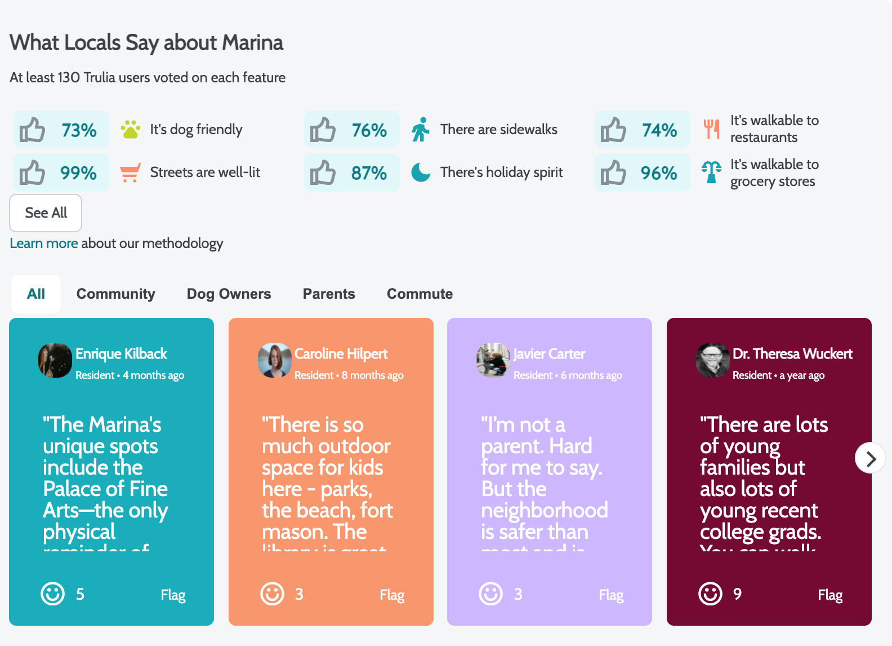

# Local Review
---

>This is local-review component of Trulia.com real estate application. It displays the reviews of local neighbors for the property. Also you can see the current ratings of features and expand the view to see more.

## Related Projects

  - https://github.com/Archon-Design/AffordabilityCalculator
  - https://github.com/Archon-Design/similar-homes-service
  - https://github.com/Archon-Design/PhotoGallery

## Table of Contents

1. [Usage](#Usage)
1. [Requirements](#requirements)
1. [Development](#development)

## Usage

> to get started, run `npm install` then `npm start`

## Requirements

An `nvmrc` file is included if using [nvm](https://github.com/creationix/nvm).

- Node 6.13.0
- etc

## Development

### Installing Dependencies

From within the root directory:

```sh
npm install -g webpack
npm install
```

